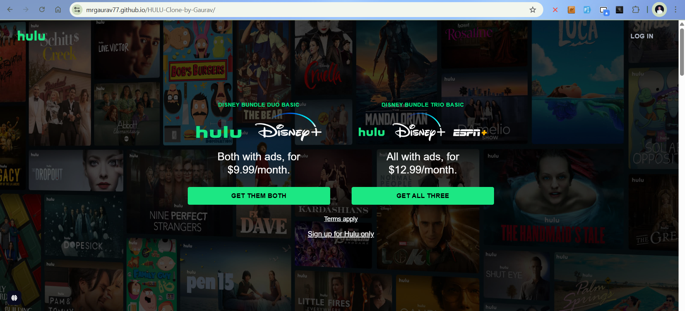
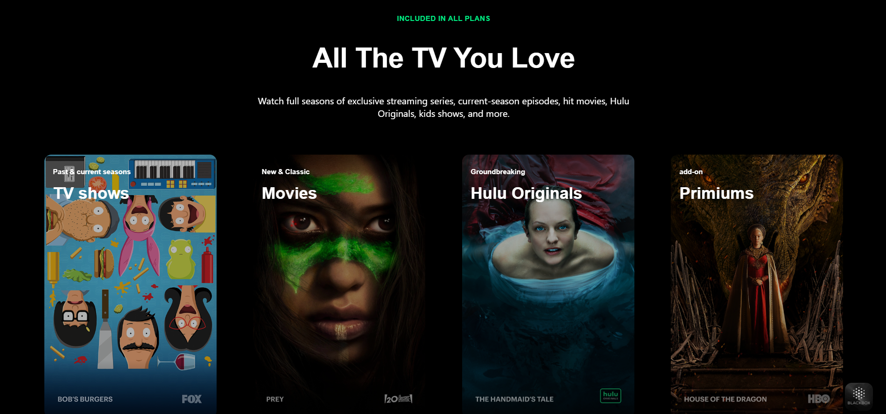
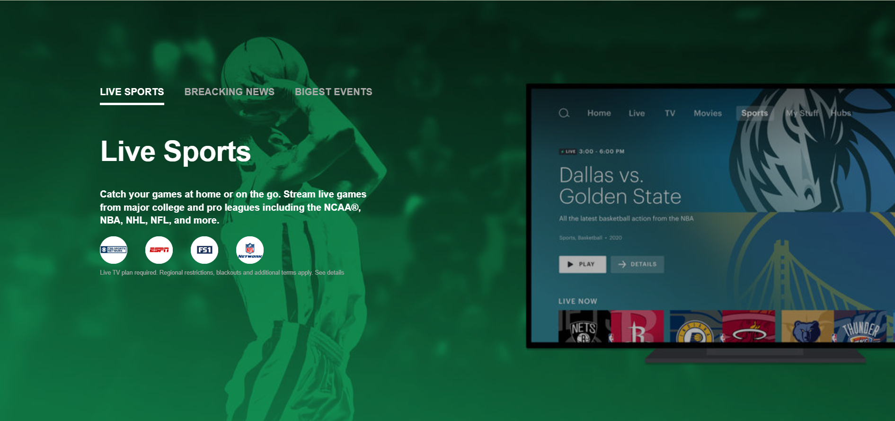
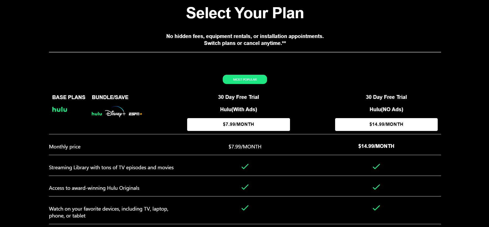

# 🎞️ Hulu Clone by Gaurav Kolhe  
A responsive and visually accurate replica of the Hulu streaming website, built using **HTML**, **CSS** and **JavaScript**. Explore film-style banners, grids of content and layout inspired by Hulu — all without backend streaming functionality.

---

## 🔴 Live Demo  
👉 [View live demo here](https://mrgaurav77.github.io/HULU-Clone-by-Gaurav/)

---

## 🖼️ Screenshots  
  

---

## 🚀 Features  
- 🎬 Banner section mimicking streaming site style  
- 📺 Content grid of movies/shows for layout drill   
- 🔧 Pure front-end: no backend streaming, focus on layout & UX  

---

## 🛠️ Tech Stack  
- **HTML** – Project structure  
- **CSS** – Styling, modern layout (flex/grid), responsive design  
- **JavaScript** – Basic interactivity   

---

